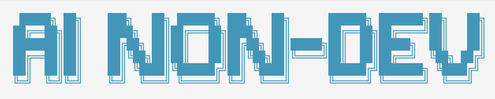

# AI for Non-Developers

<div align="center">
  
</div>

[](LICENSE)
[](CONTRIBUTING.md)

> **For those with a vision, but who don't speak "code".**

## The Problem

Today, the world is full of AI tools designed to accelerate developers. But what about those who have the idea in their head but don't know how to translate it into the language of a machine?

When a non-developer tries to build with AI, they face two major walls:
1. The technical "how" barrier
2. Massive consumption of tokens/credits trying to explain their vision

**This project exists to tear down those walls.**

## Table of Contents

- [What is This?](#what-is-this)
- [Supported Platforms](#v1-supported-platforms)
- [Core Principles](#core-principles)
- [Quick Start](#quick-start)
- [How to Use](#how-to-interact-the-product-owner-way)
- [Documentation](#documentation)
- [Contributing](#contributing)
- [License](#license)

## What is This?

This is not a "code assistant." This is an **AI Engineering Partner** framework.

### The Division of Labor

* **You (Product Owner):** You own the vision, the pain points, the desired experience, and the priorities. You define the *What* and the *Why*.
* **The AI (Engineering Partner):** It owns the technical architecture, the implementation, the file management, and the quality assurance. It defines the *How*.

## V1 Supported Platforms

This framework is optimized for tools that allow autonomous file manipulation and terminal execution:

* **Claude Code / CoWork** – [See CLAUDE.md example](docs/CLAUDE_EXAMPLE.md)
* **Gemini CLI (Antigravity)** – See GEMINI.md (coming soon)
* **OpenCode** – See OPENCODE.md (coming soon)

### Requirements

* A supported AI tool with file manipulation and terminal access
* Python 3.10+
* Git (for version control)

## Core Principles

1. **Token Efficiency**: Uses a Three-Tier Task System (Light, Standard, Heavy) to apply only the necessary rigor, saving your credits.
2. **Autonomous Discovery**: No rigid forms. The AI collects project context naturally through conversation.
3. **Self-Improving Loop**: Every mistake is documented in `.aind/lessons.md`. The AI doesn't just work; it learns from its own errors so they never happen again.
4. **Zero Technical Micromanagement**: You focus on the product. The AI focuses on the code.

## Quick Start

1. **Install `aind`** — the project manager CLI:

   ```bash
   curl -fsSL https://raw.githubusercontent.com/lufermalgo/ai-for-non-developers/main/cli/get-aind.sh | bash
   ```

2. **Initialize your project** in any folder:

   ```bash
   aind init
   ```

3. **Start building**: Open your AI tool and say: *"I want to build [My Idea]. Help me discover the details."*

## How to Interact (The Product Owner Way)

Don't tell the AI *how* to write the code. Tell it what you want the user to feel or achieve.

* **Bad:** "Create a div with a blue background and a login button."
* **Good:** "We need a login screen that feels premium and simple. Use a vibrant color palette."
* **The "Stop" Command:** If the AI is going in circles, just say: *"Stop. Replan and explain your new strategy."*
* **Tracking:** Check `.aind/tasks.md` for real-time progress and `.aind/context.md` for the current project vision.

## Documentation

Full documentation available in [`docs/`](docs/) including:

* **[Quickstart Guide](docs/quickstart.md)** – Get up and running in minutes
* **[Prompting Guide](docs/prompting-guide.md)** – How to communicate effectively with your AI partner
* **[Examples](docs/)** – Real-world patterns and workflows
* **[CLAUDE.md Example](docs/CLAUDE_EXAMPLE.md)** – Template for your own AI instructions

## Contributing

We welcome contributions from product visionaries, developers, and everyone in between!

* **Have a bug to report?** [Open an issue](https://github.com/lufermalgo/ai-for-non-developers/issues/new?template=bug_report.md)
* **Have a feature idea?** [Suggest a feature](https://github.com/lufermalgo/ai-for-non-developers/issues/new?template=feature_request.md)
* **Want to contribute code?** See [CONTRIBUTING.md](CONTRIBUTING.md)

Please read our [Code of Conduct](CODE_OF_CONDUCT.md) to understand our community values.

## Security

Found a security vulnerability? Please report it responsibly via [SECURITY.md](SECURITY.md) instead of opening a public issue.

## License

This project is licensed under the MIT License — see [LICENSE](LICENSE) for details.

---

*Created with ❤️ for the dreamers who don't want to be slowed down by syntax.*
